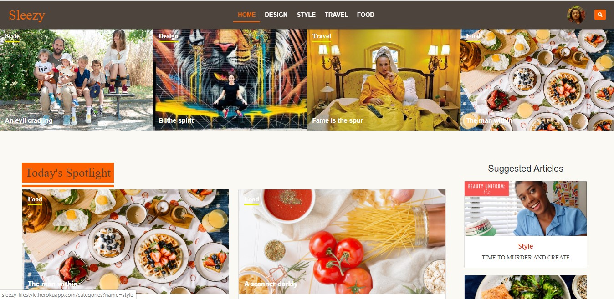

# SLEEZY - LIFESTYLE ARTICLES WEB APP PROJECT

This project is a Lifestyle Articles Web application built with rails. It implements the basic functionality found on the popular lifestyle websites. It's a website where writers can write on things they care about based on the article categories. 

## Table of Contents

* [About the Project](#about-the-project)
  * [Built With](#built-with)
* [Live Preview](#live-preview)
* [Data Architecture Documentation (ERD)](#data-architecture-documentation-(ERD))
* [Required Installations](#required-installations)
* [Instalation of This App](#instalation)
* [License](#license)
* [Contact](#contact)
* [Acknowledgements](#acknowledgements)


<!-- ABOUT THE PROJECT -->
## About The Project

This project is a Lifestyle Articles web application. In this project, users can sign up using their usernames only. Once a user becomes a member, such a user can be able to create articles for readers to read, edit their profile, comment on articles. That user can also vote for articles and bookmark articles for future reads. A reader can use the app whether he/she is a member or not but is limited to features they can access. Such a reader can only read and comments on other articles. The main goal is to build a full-fledged web app in real-time and also practice the main concepts of MVC, Model Associations, Session Authentications with bcrypt, and perform units & integration testing with RSpec and Capybara.


<!-- BUILT WITH -->
### Built With 

* HTML
* CSS
* Git
* Ruby
* Ruby on Rails


<!-- LIVE PREVIEW -->
## Live Preview

This is the link to the live preview in Heroku. Feel free to visit.<br>
<a href="https://sleezy-lifestyle.herokuapp.com">Sleezy - Lifestyle Articles Web App</a> <br>
<p>Below are the HomePage Screenshots</p>

<br>
<br>


## Features

* Users can signup/login and create articles to publish.
* Users can save articles for future editing.
* Users can vote an article.
* Users can bookmark articles for future reads.
* Readers/Users can comment on articles.
* Users can search for articles by their titles.
* Images are hosted in Amazon S3 cloud storage on production.

<!-- ERD -->
## Data Architecture Documentation (ERD)
The image below is a copy of the Entity Relationship Diagram generated for this project.
<br>


<!-- REQUIRED INSTALLATION -->
## Required Installations

<p>If you want a copy of this project running on your machine you have to install:</p>

* Ruby 2.6.4
* Gem 3.0.3
* Rails 6.0.2
* Bundler 2.0.2

<a href="https://www.tutorialspoint.com/ruby-on-rails/rails-installation"> Installation Instructions</a>

<!-- INSTALLATION -->
## Installation of This App

Once you have installed the required packages shown on the [Required Installations](#required-installations), proceed with the following steps

Clone the Repository,

```Shell
your@pc:~$ git clone https://github.com/adaorachi/lifestyle-articles
```

Move to the downloaded folder

```Shell
your@pc:~$ cd lifestyle-articles
```

install gems

```Shell
your@pc:~$ bundle install --without production
```

create, migrate and seed the database

```Shell
your@pc:~$ rails db:create
```

```Shell
your@pc:~$ rails db:migrate
```

```Shell
your@pc:~$ rails db:seed
```

If you run into any problem while performing any of the last three commands, running the following command will drop the database and initialize those commands automatically.

```Shell
your@pc:~$ rails db:reset
```

Finally, run the app in a local server:

```Shell
your@pc:~$ rails server
```

Then, go to [http://localhost:3000](http://localhost:3000)


  ### How to login as an admin
  For security purposes, one admin user will be automatically generated when you seed the database. The admin will have all privileges and exclusive rights to perform some actions such as creating the categories. Login details are as follows:<br>
  username: johndoe<br>
  password: admin123<br>

  You can choose to change your username and password once you are logged in.

## Test Run

To run the unit test, follow these steps.

Open a terminal

Install the rspec gem if you have not already

```Shell
your@pc:~$ gem install rspec
```

Run RSpec in the terminal

```Shell
your@pc:~$ rspec
```

## Future Features
Some of the features or improvements I would like to implement on this project is to add more unit test to the test suite.


<!-- LICENSE -->
## License

Distributed under the MIT License. See `LICENSE` for more information.

<!-- CONTACT -->
## Author
* MaryAnn Chukwuka - annychuks07@gmail.com | [Github Account https://github.com/adaorachi](https://github.com/adaorachi)

<!-- ACKNOWLEDGEMENTS -->
## Acknowledgements
I would like to credit <a href="https://www.behance.net/sakwadesignstudio">Nelson Sakwa</a> for his Behance design ideas which I used in creating this app. The project's color, typography, and layouts were gotten from this design. The design can be seen <a href="https://www.behance.net/gallery/14554909/liFEsTlye-Mobile-version"></a>. I love the design.
