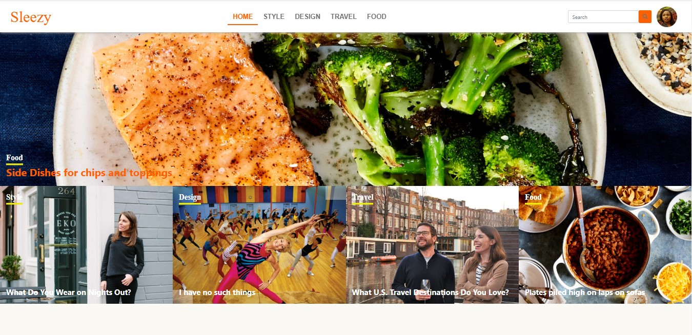

# SLEEZY - LIFESTYLE ARTICLES WEB APP PROJECT

This project is a Lifestyle Articles Web application built with rails. It implements the basic functionality found on the popular lifestyle websites. Its a website where writers can write on things they care about based on the article categories. 

## Table of Contents

* [About the Project](#about-the-project)
  * [Built With](#built-with)
* [Live Preview](#live-preview)
* [Data Architecture Documentation (ERD)](#data-architecture-documentation-(ERD))
* [Required Installations](#required-installations)
* [Instalation of This App](#instalation)
* [License](#license)
* [Contact](#contact)
* [Acknowledgements](#acknowledgements)


<!-- ABOUT THE PROJECT -->
## About The Project

This project is a Lifestyle Articles application. In this project, users can sign up using their username only. Once a user becomes a member, such user can be able to create articles for readers to read, edit their profile, comment on an articles. That user can also vote for articles and bookmark articles for future reads. A reader can use the app whether he/she is a member or not but is limited to features they can access. Such reader can only read and comments on other articles. The main goal is to build a full-fledged web app in real time and also in practice the main concepts of MVC, Model Associations, Session Authentications with devise bcrypt, and units & integration testing with RSpec and Capybara.


<!-- BUILT WITH -->
### Built With 

* HTML
* CSS
* Git
* Ruby
* Ruby on Rails


<!-- LIVE PREVIEW -->
## Live Preview

This is the link to the live preview in Heroku. Feel free to visit.<br>
<a href="https://sleezy-lifestyle.herokuapp.com">Sleezy - Lifestyle Articles Web App</a> <br>
<p>Below are the HomePage Screenshots</p>

<table>
  <thead>
    <tr>
      <th>Larger Screen View</th>
      <th>Smaller Screen View</th>
    </tr>
  </thead>
  <tbody>
    <tr>
      <td rowspan=4></td>
      <td rowspan=2></td>
    </tr>
  </tbody>
</table>

## Features

* Users can signup/login and create articles to publish.
* Users can save articles for future editing.
* Users can vote an article.
* Users bookmark articles for future reads.
* Readers/Users can comment on articles.
* Users can search for articles by their titles.

<!-- ERD -->
## Data Architecture Documentation (ERD)
The image below is a copy of the Entity Relationship Diagram generated for this project.
<br>


<!-- REQUIRED INSTALLATION -->
## Required Installations

<p>If you want a copy of this project running on your machine you have to install:</p>

* Ruby 2.6.4
* Gem 3.0.3
* Rails 6.0.2
* Bundler 2.0.2

<a href="https://www.tutorialspoint.com/ruby-on-rails/rails-installation"> Installation Instructions</a>

<!-- INSTALLATION -->
## Installation of This App

Once you have installed the requiered packages shown on the [Required Installations](#required-installations), proceed with the following steps

Clone the Repository,

```Shell
your@pc:~$ git clone https://github.com/adaorachi/lifestyle-articles
```

Move to the downloaded folder

```Shell
your@pc:~$ cd facebook_clone
```

install gems

```Shell
your@pc:~$ bundle install --without production
```

migrate and seed the database

```Shell
your@pc:~$ rails db:migrate
```

```Shell
your@pc:~$ rails db:seed
```

Run the app in a local server:

```Shell
your@pc:~$ rails server
```

Then, go to [http://localhost:3000](http://localhost:3000)

<!-- LICENSE -->
## License

Distributed under the MIT License. See `LICENSE` for more information.

<!-- CONTACT -->
## Author
* MaryAnn Chukwuka - annychuks07@gmail.com | [Github Account https://github.com/adaorachi](https://github.com/adaorachi)

<!-- ACKNOWLEDGEMENTS -->
## Acknowledgements
I would like to credit <a href="https://www.behance.net/sakwadesignstudio">Nelson Sakwa</a> for his behance design ideas which I used in creating this app. The project's color, typograpy and layouts were gotten from this design. The design can be seen <a href="https://www.behance.net/gallery/14554909/liFEsTlye-Mobile-version"></a>. I really love the design.